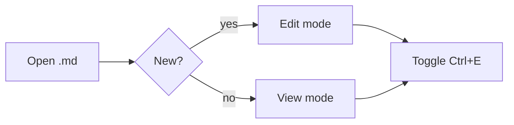

# markdpad sample

A quick tour of what the renderer handles.

## Text & inline

**Bold**, *italic*, ~~strike~~, `inline code`, [a link](https://example.com).

## Lists

- bullet one
- bullet two
  - nested

1. ordered
2. items

- [x] task done
- [ ] task open

## Code

```rust
fn main() {
    println!("Hello from markdpad");
}
```

```python
def fib(n: int) -> int:
    return n if n < 2 else fib(n - 1) + fib(n - 2)
```

## Math

Inline: $E = mc^2$.

Display:

$$
\int_{-\infty}^{\infty} e^{-x^2}\, dx = \sqrt{\pi}
$$

## Mermaid



## Table

| Mode | Default for | Toggle |
|------|-------------|--------|
| view | existing files | Ctrl+E |
| edit | new files | Ctrl+E |

> Modes are remembered per file — your last choice for a path is restored next time you open it.
